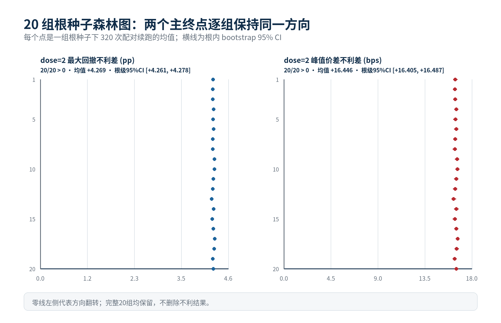
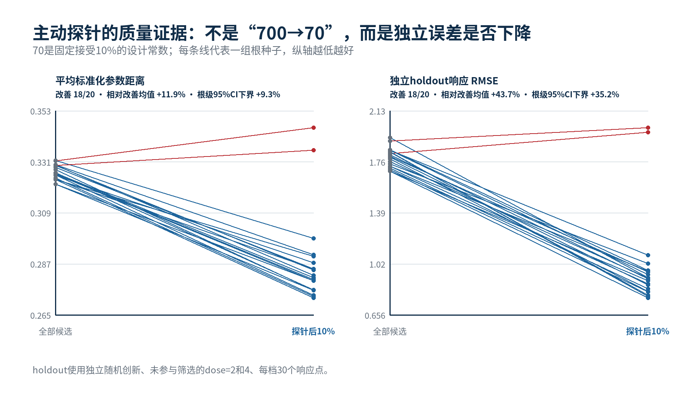

<div align="center">

# MarketGenesis

### 预测价格已经不够了，我们要重建市场。

**让决策看见不止一个未来。**

从价格轨迹预测，到生成机制的多候选重建与主动辨识

*A research prototype toward decision-making across possible worlds.*

**Evan 云期 · 宇树科技天才少年计划入选项目¹**

[中文](README.md) · [English](README_EN.md)

[项目申请书](assets/MarketGenesis_Proposal.pdf) · [一页成果](assets/MarketGenesis_Evidence_OnePager.pdf) · [实验报告](assets/MarketGenesis_Research_Report.pdf) · [原始演示视频](assets/MarketGenesis_Demo_Original.mov) · [复现指南](#五分钟开始) · [用途与路线图](docs/VISION_AND_APPLICATIONS.md)

</div>

> **我们研究的是市场，还是市场留下来的痕迹？**
>
> 价格，不是世界本身，它只是低维投影。

**同样是 25°C，一个房间可能正在升温，另一个却正在降温。温度相同，不等于房间相同；价格相同，也不等于市场相同。**

我们希望建立一座“可能世界实验室”：面对同一段市场历史，不急于给出唯一解释，而是生成多个候选机制，预演它们在同一行动下的不同未来，再寻找能够区分它们的新证据。

**它要解决的不是“猜得更肯定”，而是“在原因尚未确定时，怎样判断得更可靠”。** 远期目标是为决策者提供一层机制推演能力：看见隐藏的脆弱性，比较不同方案的后果，知道还缺哪一条证据。

第一步已经落在一个可复现的人工市场实验上：过去的价格、成交量和流动性表现完全相同的两个市场，会在相同冲击后分叉；有限候选库经探针筛选后，在多数根种子上更接近合成真值、也更能解释未参与筛选的响应。

当前交付的是**合成人工市场中的机制辨识原型**。上面的决策实验室是研究方向；本仓库还不是实盘交易系统、真实市场数字孪生或通用决策产品。

## 先看这一张图


蓝色与红色代表两种内部结构；冲击前，六类可见观测量的差为 **0**。冲击后，共同随机噪声与相同外部冲击下，两条轨迹分叉。这里的“完全相同”是模拟器刻意构造的对照条件，不是在真实市场数据里发现的规律。

## 如果这条路线成立，它能用来做什么？

这些是**可检验的应用设想，不是现有功能清单**。

| 应用方向 | 一个具体问题 | 希望提供的帮助 | 距离落地还差什么 |
| --- | --- | --- | --- |
| **看见尚未发生的风险** | 两个市场都很平静，哪个更可能在资金收紧时出现连锁抛售？ | 在多种候选机制下压力测试，展示风险从哪里放大，而非只报一个风险分数 | 真实数据校准、外部验证、与现有风险模型公平比较 |
| **让规则先在沙盒里接受检验** | 调整保证金、交易频率或流动性规则，会缓冲风险还是转移风险？ | 在实施前对照候选机制下的后果，找出依赖某一种假设才成立的方案 | 可变化的规则模块、主体适应行为、成本与副作用评估 |
| **让机器先辨原因，再选动作** | 同样的机器人拥堵，究竟来自低电量、通信中断还是任务冲突？ | 用低成本、安全的小任务区分原因，再比较多个解释下都可靠的行动 | 单独的机器人任务环境、安全约束和实体迁移验证 |

共同目标不是把一个答案说得更确定，而是把**可能原因、未来分支、下一步取证和行动代价**放到同一张决策桌上。具体产品形态、研究阶段与验证门槛见 [用途与路线图](docs/VISION_AND_APPLICATIONS.md)。

## 我们具体在做什么

| 从一个问题出发 | 当前实现 | 想检验的事情 |
| --- | --- | --- |
| 一样的历史，是否意味着一样的市场？ | 两种内部参数不同的人工市场，使用同一组外部随机扰动 | 观察历史能否唯一确定冲击响应 |
| 证据不够时，为什么只能给一个答案？ | 在同一动力学模型中抽样 700 组内部参数，保留多个候选世界 | 多个解释如何与同一段历史相容 |
| 能否主动获取有区分力的证据？ | 施加预先规定的小冲击，按响应距离保留最接近的 10% 候选 | 筛选后能否改善参数距离与未见冲击的响应误差 |

研究重点是把**观测等价 → 多候选机制 → 干预区分 → 留出检验**接成一条可以检查、复现和推翻的证据链。潜在状态、人工市场与主动辨识各有成熟研究基础；项目的切入点在于把问题、对照实验和可审计结果连起来，而不是宣称相关思想从未出现过。

## 已经得到的结果

| 检查项 | 固定种子实验 | 20 个根种子的稳定性检查 |
| --- | --- | --- |
| 冲击前可见观测差 | **0**；零冲击对照也为 0 | 全部满足对应对照检查 |
| dose=2，脆弱世界的额外锚定损失² | **+4.25 个百分点** | 平均 **+4.269pp**，20/20 同向 |
| dose=2，额外峰值买卖价差 | **+16.31 基点** | 平均 **+16.446bps**，20/20 同向 |
| 候选集平均归一化参数距离 | **0.330 → 0.278** | 平均相对改善 **11.89%**，18/20 改善 |
| 留出冲击的响应误差³ | **1.896 → 0.934** | 平均相对改善 **43.73%**，18/20 改善 |

固定根种子 `20260830`；每个剂量 320 次配对重复。稳定性检查使用 20 个根种子，每剂量共 6,400 对路径。完整数值、区间与逐路径数据分别保存在 [固定种子数据](reference/data/) 和 [多种子数据](reference_robustness/data/)。

**700 → 70 是筛选规则，不是成功率。** 因为事先规定保留最接近的 10%，候选数减少本身不能证明有效；参数距离和独立留出响应才是质量检查。两项质量指标各有 2/20 个根种子未改善，负结果没有删去。

<details>
<summary>查看多种子图与指标口径</summary>





² 历史字段 `max_drawdown` 计算的是“冲击前价格锚点到冲击后最低价的损失”，不是通常的滚动峰谷最大回撤。旧图和申请材料保留了原字段名称，解读以此定义为准。

³ 留出指标为每个候选的标准化响应 RMSE，再取候选集合的中位数；不是下一日价格预测误差。留出随机创新独立于筛选阶段；同一阶段中候选与合成真值仍共享随机流以降低比较噪声。留出剂量为 2 和 4，筛选剂量为 1.5。

多种子报告给出的根种子 bootstrap 95% 区间：锚定损失差 `[4.261, 4.278]pp`、价差差 `[16.405, 16.487]bps`；参数距离相对改善 `[9.29%, 13.87%]`、留出响应相对改善 `[35.15%, 50.14%]`。这些区间只描述当前模拟器家族内的随机变化。

</details>

## 五分钟开始

需要 **Python 3.11 或更新版本**（建议 3.12）和首次安装依赖时的网络连接。下载仓库 ZIP、解压后，在仓库目录运行：

```bash
python3 -m venv .venv
source .venv/bin/activate
python -m pip install -r requirements.txt
python reproduce.py
```

Windows 用 `.venv\Scripts\activate` 激活环境；也可直接使用对应的双击入口：

| 系统 | 固定种子精确复现 | 20 根种子重复实验 |
| --- | --- | --- |
| macOS | `RUN_FIXED_SEED_MAC.command` | `RUN_MULTI_SEED_MAC.command` |
| Windows | `RUN_FIXED_SEED_WINDOWS.bat` | `RUN_MULTI_SEED_WINDOWS.bat` |

固定种子计算完成后，打开 `reproduced/打开查看结果.html`。终端应出现：

```text
PASS | 0 | +4.25pp | +16.31bps | parameter 0.330→0.278 | holdout 1.896→0.934
```

再运行完整多种子检查：

```bash
python robustness_reproduce.py
```

结果在 `robustness_reproduced/打开查看稳健性结果.html`。耗时取决于机器；双击启动器会处理虚拟环境与依赖安装。**重复执行会替换上述生成结果目录，不会改动 `reference/` 与 `reference_robustness/`。**

无须重算也能检查现有参考结果；重算之后还可以对比新数据：

```bash
python verify.py
python verify.py --reproduced --multiseed
```

第二条要求两个实验均已运行。不同系统的字体会影响 PNG 像素，不应据此判断数据复现失败。Linux 建议安装 Noto CJK 字体，避免图表中文缺字。

## 演示与完整资料

- **[原始真人视频](assets/MarketGenesis_Demo_Original.mov)**：保留原文件，没有剪辑、配音替换或重新编码。
- **[交互演示](demo.html)**：下载后用浏览器打开，或在 Mac 双击 `OPEN_DEMO_MAC.command`。这是预计算参考轨迹的交互回放；按钮不启动 Python 实验。GitHub 文件页只显示源码，不能直接执行 HTML。
- **[项目申请书](assets/MarketGenesis_Proposal.pdf)**：问题、研究设想与长期方向。
- **[实验报告](assets/MarketGenesis_Research_Report.pdf)**：实验设计、数据、可证伪边界与后续验证。
- **[一页成果速览](assets/MarketGenesis_Evidence_OnePager.pdf)**：快速了解核心证据。
- **[通俗复现指南](docs/BEGINNER_REPRODUCTION_ZH.md)** · **[实验七问](docs/SEVEN_QUESTIONS_ZH.md)** · **[三个为什么](docs/THREE_WHYS_ZH.md)**。

PDF 为当时提交材料的公开副本，仅移除了私人联系方式及文件元数据；文中申请金额、历史措辞与待完成计划不代表现已获得资助或已经实现。

## 文件地图

```text
MarketGenesis/
├── code/                       # 人工市场模型与多种子实验
├── reproduce.py                # 固定种子：重新计算，不是复制参考图
├── robustness_reproduce.py     # 20 根种子稳定性检查
├── verify.py                   # 参考文件完整性与实验约束检查
├── requirements.txt            # 固定版本依赖
├── reference/                  # 固定种子原始数据、配置与三张图
├── reference_robustness/        # 多种子逐路径数据、汇总与三张图
├── assets/                     # 三份公开 PDF 与原始演示视频
├── docs/                       # 方法、复现、问答与披露
├── demo.html                   # 离线交互回放
└── .github/workflows/          # 自动复现检查
```

## 不止于预测：我们希望走向哪里

**我们想追问的，不止是未来的轨迹：轨迹背后还有哪些可能的世界，每一种世界又会怎样回应你的行动？**

理解市场只是第一步。更远的目标，是建立一种**主动式多假设世界模型**：不仅回答“接下来可能发生什么”，还回答“这些未来分别由什么机制产生”“哪一次小实验最能区分它们”，以及“在不知道哪一个世界才是真的时，什么行动仍然可靠”。

**从读懂市场留下的痕迹，到检验市场可能的构成；从押注一个未来，到面对多个未来作出稳健决策。** 市场是第一座试验场。如果机制辨识的证据链成立，这一问题可以延伸到机器人群体、交通与复杂协作系统；迁移效果需要另做实验，不能从金融沙盒直接推出。

当前已经实现透明人工市场、候选参数库、固定探针筛选和留出检查。学习式生成器、自适应探针选择、多世界稳健规划、真实市场校准及实体机器人验证，均属于**尚未完成的研究方向**。

| 研究阶段 | 要跨过的门槛 | 当前状态 |
| --- | --- | --- |
| 让隐藏差异显形 | 同一历史、同一冲击，不同内部机制产生不同响应 | 已在同族合成实验中实现 |
| 让候选解释接受检验 | 换根种子后，筛选质量与留出响应是否仍改善 | 已检查，质量指标各 18/20 改善 |
| 让模型知道自己可能错了 | 真机制不在候选库时，是否能识别失配；跨结构族能否保持覆盖 | 待实现与验证 |
| 让取证服务于行动 | 自动选择风险可控的探针，多世界规划是否降低决策损失 | 待实现与验证 |
| 让方法走出第一座沙盒 | 用独立真实数据或独立任务环境检验实际增益 | 待验证 |

这条路线真正想改变的是决策的起点：**不再先假定自己理解了世界，而是先弄清楚，还有哪些世界不能被排除。**

## 边界、署名与计划状态

- 这是同一模型家族内的合成存在性证明与稳定性检查，不是重建真实市场、获得交易 alpha 或优于现有量化方法的证据。
- 真值与候选来自同一参数族；共享随机流、预设参数范围与固定接受比例会影响实验难度。尚无跨结构族验证或强基线公平比较。
- “主动”指主动施加预设的沙盒冲击；当前没有自动寻找最优探针，也不在真实市场实施干预。
- 运行前写出协议及哈希，不等同于外部独立时间戳的正式预注册。
- 研究与 AI 辅助开发分工见 [AI_USAGE.md](AI_USAGE.md)。背景讨论与文献见申请书参考页；潜在状态建模、人工市场和 ABC 均有成熟研究基础。
- ¹ **计划状态说明（2026-10-08）**：项目负责人确认已收到宇树科技天才少年计划入选邮件；通知原文未在本仓库公开。此处为项目方披露，不是宇树官方公告，不表示宇树为本仓库研究结论背书，也不声明已拨付任何金额。
- 本仓库公开供阅读与复现，暂未指定开源许可证；不额外授予再分发、商业使用或第三方素材权利。视频及文档请保留署名，其他使用请通过仓库 Issues 联系作者。

---

**English summary.** MarketGenesis is a reproducible synthetic-market prototype for observational equivalence, candidate mechanism reconstruction, and intervention-based discrimination. It includes paired-shock experiments, a finite candidate parameter bank, held-out response checks, and a 20-root-seed stability study. It does not establish real-market identification, trading profitability, or robotic transfer. Program-selection status is reported by the project owner, not independently certified by this repository.
