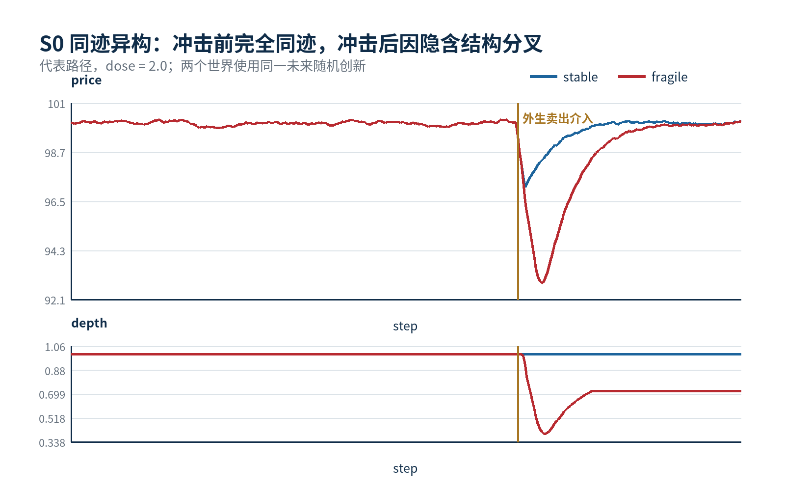

[中文版](README.md)

<div align="center">

# MarketGenesis

### Help decisions see more than one future.

**Explore the hidden mechanisms behind identical histories.**

A reproducible synthetic-market prototype toward decision-making across possible worlds.

**Evan 云期 · Selection for Unitree's 天才少年计划 reported by the project owner¹**

[Research proposal](assets/MarketGenesis_Proposal.pdf) · [Evidence brief](assets/MarketGenesis_Evidence_OnePager.pdf) · [Research report](assets/MarketGenesis_Research_Report.pdf) · [Original video](assets/MarketGenesis_Demo_Original.mov)

</div>

Two rooms can have the same temperature while one is warming and the other is cooling. The same observation can hide different internal states. Could two markets with identical visible histories also respond differently to the same shock?

**MarketGenesis makes this question runnable.** In a controlled artificial market, hidden differences in leverage, inventory, and risk constraints remain dormant during quiet periods. An identical external shock activates them and produces divergent responses. The prototype then tests whether a fixed probe can help filter a finite set of candidate mechanisms.

The longer-term ambition is a laboratory of possible worlds: retain explanations compatible with the evidence, compare their responses to an action, and identify what evidence would help distinguish them. The present repository implements an early mechanism-identification experiment; adaptive experimentation and decision planning remain research goals.



The six observed quantities match exactly before the shock **by construction**. This is a simulator-controlled example, not a finding of exact equivalence in real-market data.

## What the prototype implements

**Observational equivalence → candidate mechanisms → intervention-based discrimination → held-out checks.**

The code compares two parameterizations of the same market equations under shared random innovations, samples **700 parameter vectors** from that simulator family, applies a predetermined probe, and retains the **10%** with the closest responses. It then checks parameter distance and responses to held-out shocks.

| Measure | Fixed root seed | Across 20 root seeds |
| --- | --- | --- |
| Pre-shock observable difference | **0**; zero-shock control also 0 | Corresponding controls pass |
| Additional anchor-based loss, dose 2² | **+4.25 percentage points** | Mean **+4.269 pp**; same direction in 20/20 |
| Additional peak bid–ask spread, dose 2 | **+16.31 basis points** | Mean **+16.446 bps**; same direction in 20/20 |
| Mean normalized parameter distance | **0.330 → 0.278** | Mean relative improvement **11.89%**; improves in 18/20 |
| Held-out response error³ | **1.896 → 0.934** | Mean relative improvement **43.73%**; improves in 18/20 |

Fixed root seed: `20260830`; 320 paired repetitions per dose. The stability study contains 6,400 paired paths per dose. Inspect the [fixed-seed data](reference/data/) and [multi-seed data](reference_robustness/data/).

**700 → 70 is a selection rule, not a success rate.** The quality measures each fail to improve for 2 of the 20 root seeds; those results are retained.

## Where this research could lead

These are conditional application directions, **not delivered features**.

| Direction | A concrete question | Validation still required |
| --- | --- | --- |
| **Risk before it becomes visible** | Which apparently calm market could develop a liquidation cascade after funding tightens? | Real-data calibration, external validation, and fair comparisons with established risk models |
| **Rules tested in a sandbox** | Would a margin or liquidity-rule change absorb stress or move it elsewhere? | Configurable rules, agents that adapt to them, and evaluation of costs and side effects |
| **Robots that investigate causes** | Is a slow-moving robot group limited by batteries, communications, or conflicting tasks? | A separate robotics environment, safe probes, and simulation-to-hardware validation |

A future research workbench could bring candidate explanations, conditional futures, evidence-gathering costs, and robust actions into one workflow. See the [vision and validation roadmap](docs/VISION_AND_APPLICATIONS.md) (Chinese).

## Quick start

Requires **Python 3.11+** (3.12 recommended) and internet access for the initial dependency installation. Download and extract the repository, then run:

```bash
python3 -m venv .venv
source .venv/bin/activate
python -m pip install -r requirements.txt
python reproduce.py
python robustness_reproduce.py
python verify.py --reproduced --multiseed
```

On Windows, activate with `.venv\Scripts\activate`. Double-click launchers are also included for macOS and Windows. Open `reproduced/打开查看结果.html` and `robustness_reproduced/打开查看稳健性结果.html` after computation. Reruns replace those generated output directories while preserving the reference directories. Run `python verify.py` alone to inspect the shipped reference results without recomputing.

The [interactive demo](demo.html) replays precomputed reference trajectories; its controls do not run Python experiments. Download it and open it locally in a browser. GitHub's file viewer displays its source rather than executing the page. The [original demonstration video](assets/MarketGenesis_Demo_Original.mov) is included without editing or re-encoding.

## Evidence and scope

The evidence is a synthetic existence demonstration and stability study **within one simulator family**. It does not establish identification of real markets, trading profitability, superiority to existing quantitative methods, or transfer to robotics. Truth and candidates share a parameter family; common random streams, chosen parameter ranges, and the fixed acceptance fraction affect experimental difficulty. Cross-family validation and fair strong-baseline comparisons remain outstanding.

“Active” means applying a predetermined shock inside the sandbox. There is no optimal-probe search or intervention in real markets. Learned candidate generation, mismatch detection, multi-world planning, and real-data calibration remain future work. Writing a protocol and hash before execution is not independently timestamped preregistration.

² The historical `max_drawdown` field measures loss from the pre-shock price anchor to the post-shock minimum, not conventional rolling peak-to-trough drawdown.

³ The held-out metric is the median, across candidates, of standardized response RMSE; it is not next-day price forecast error. Held-out innovations are independent of the filtering stage, while candidates and synthetic truth share random streams within each stage. Filtering uses dose 1.5; held-out doses are 2 and 4. Reported uncertainty describes variation within this simulator family only.

## Materials and attribution

The [beginner guide](docs/BEGINNER_REPRODUCTION_ZH.md), [seven experimental questions](docs/SEVEN_QUESTIONS_ZH.md), [three whys](docs/THREE_WHYS_ZH.md), and [verification record](docs/VERIFICATION.md) provide additional detail in Chinese. The linked PDFs are public copies of the historical submission materials with private contact information and metadata removed; proposed funding amounts and planned work are not evidence of funding received or capabilities delivered.

Research and AI-assisted development roles are disclosed in [AI_USAGE.md](AI_USAGE.md). Latent-state modeling, artificial markets, and approximate Bayesian computation have established research foundations; references are included in the proposal.

¹ **Program status, 2026-10-08:** the project owner reports receiving an acceptance email for Unitree's 天才少年计划. The email is not public in this repository. This is a project-owner report, not an independently verified official announcement or an endorsement of the research by Unitree; no funding disbursement is claimed.

The repository is public for reading and reproduction but **has no designated open-source license**. It does not grant additional redistribution, commercial-use, or third-party-material rights. Retain attribution on documents and video; contact the author through repository Issues for other uses.
